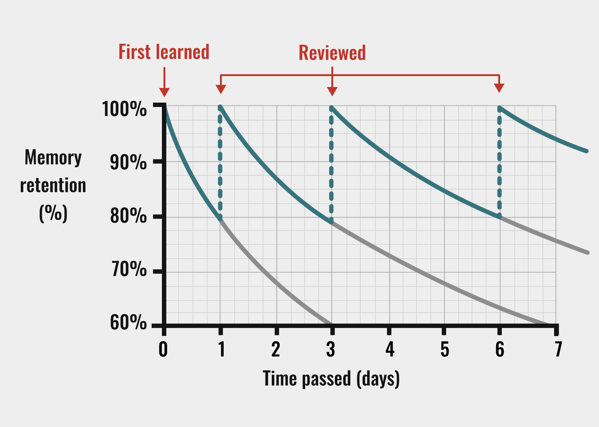

Hey! Do you also feel like there’s never enough time to study even though all you do is study? We sit at the desk for hours, trying to make the information stick in our heads using everything from weirdly aesthetic notes, tedious study schedules and, when all else fails, staring at the textbooktext book and hoping we somehow developed photographic memory. I, just as much as the next guy, would like to make this more effective. So today I’m going to share some tips on how to study effectively using Memoriter, our AI flashcard study app.

# 4 ways to study more effectively

## 1. Use spaced repetition

Tale as old as time. For over a hundred years this technique, first proposed by German psychologist Hermann Ebbinghaus, has been used to help people cement important information in their long term memory. It is based on a forgetting curve and suggests you can reset this curve by active recall, making an effort to remember something, in regular intervals. It’s basically just “practice makes perfect”!
Now, maybe you feel as if you’ve tried this before, but the thing is, with Memoriter, the app does everything for you.

<blockquote class='callout' icon='💡'>
Based on your answers, the algorith will calculate when you should study the card again.
</blockquote> 
It also motivates you by showing how long your study streak is. If we can send face selfies back and forth for several years, we can certainly manage some flashcards. No need to stress, just study!

<figcaption>How spaced repetion works</figcaption>

## 2. Share folders with your class

Something that we tend to forget in this world is the power of community, Memoriter wants to remind you, just as we remind you to study. I love learning languages and don’t mind doing the work of creating a list of flashcards, but if someone else has already done the work, why should I do it again? In language classes the whole class usually learns the same exact list of words.

<blockquote class='callout' icon='♻️'>
Why force the whole class to waste their time making 20 identical flashcard sets, when one person can make it and share it with the entire class?
</blockquote>

## 3. AI helps you study

Ah okay I hear you, even with the share feature you still ended up as the one making the flashcards. But, before you sit there and grumble over how long it’s gonna take and how everyone else just needs to get up and work, let me help you. With Memoriter, it is possible to make the flashcard making process a lot quicker with everyone’s new favourite toy, AI. The AI autocompletes the questions you put on your flashcards, saving you lots of time searching in textbooks and formulating an answer. You’ll have a full set ready to study in no time!

## 4. Use cramming

Now that you don’t have to waste time on figuring out what to study when and then making a long study guide, you can get straight to it. Teachers love assigning a stupid amount of information to memorize, shortly before testing us on it. Memoriter has a solution for this too. You can study large flashcard decks mere hours before an exam. Memoriter will repeat missed ones and remove correct ones. We all love spaced repetition, but when all else fails, Memoriter helps you cram like never before.

## 5. Use the app

Hey, why are you even still reading this? Why not test out the AI now, make some cards, share them with your class, and let Memoriter tell you what to know and when to know it. Study smarter, not harder!
