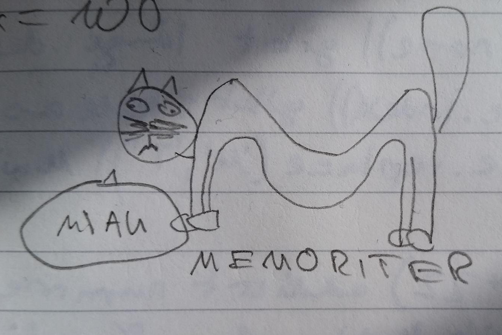

One of the main tasks during school or university is to remember facts. From studying for exams to doing homework, it's beneficial to recall facts in a lot of situations. That's why the advent of Memoriter, an innovative tool that uses science backed methods to help people remember data more effectively, has been so revolutionary. But what exactly is Memoriter and how does it work? Here, we'll discuss the science behind Memoriter, including active recall, spaced repetition, and the impact these techniques have on memory and learning. To make it a bit more fun we'll be explaining these methods using emojis.

[Sources of the following text](https://www.lipsum.com/feed/html)
            
# What scientific methods does Memoriter use?

Memoriter is a web app that helps people learn, remember, and recall information more effectively. It does this through two main scientific methods: active recall and spaced repetition.

Active recall is the process of actively retrieving information from memory. The idea is that if you make an effort to recall something, you are more likely to remember it in the future. For example, if you were studying for an exam, you could try to recall the answers to the questions with the help of Memoriter's flashcards.

Spaced repetition is another scientific method used by Memoriter. This involves revisiting information at intervals, which allows the brain to store the information in long term memory. For example, if you were studying for an exam, you could review the material at regular intervals in order to better remember it.

## What is active recall?

Active recall works like this: 🧠🔍📝🔄💭

🧠 represents the brain, which is the organ responsible for processing and storing information.

🔍 represents the act of actively searching or trying to recall information.

📝 represents the material or information that the learner is trying to remember, such as notes or a textbook.

🔄 represents the process of repeating the recall process multiple times in order to strengthen the memory and make the information more easily retrievable.

💭 represents the thought process involved in active recall, as the learner is actively thinking about and trying to remember the information.

Active recall is a powerful memory technique that can help you remember information more effectively. It involves actively trying to recall information from memory, rather than passively reviewing it. Many people rely on passive studying methods, such as re-reading notes or looking over flashcards, to try and remember information. However, research has shown that these methods are not as effective as active recall.

Passive studying methods don't engage the brain in the process of remembering information. This can lead to a lack of retention and difficulty recalling information when it is needed. This is where active recall comes in as an effective solution to this problem. It forces the brain to actively retrieve information from memory. This process helps to strengthen the neural connections associated with the information, making it more likely to be remembered in the future.

Active recall has been shown to be one of the most effective memory techniques. <blockquote class='callout' icon='🔥'>
Research has shown that active recall can improve retention and recall of information by up to 40%
</blockquote>
So, it can be a game-changer for those who are struggling to remember information, especially when it comes to learning new skills or preparing for exams.


In conclusion, instead of passively reviewing information, try actively recalling it and see the difference it makes. You can use Memoriters regular study mode for that, or try toggeling the 'only question' option to use active recall. By actively recalling information, you can improve your memory and retain the information for a longer period of time. So, next time when you are studying for an exam or trying to learn something new, give active recall a try and see the results for yourself!


## What is spaced repetition?

Spaced repetition works like this: 🧠📅🔁🔥💪

🧠 represents the brain

📅 represents the passage of time

🔁 represents repetition

🔥 represents the strengthening of neural connections

💪 represents the improvement in memory or retention.

Many people rely on cramming to prepare for exams or to learn new information. However, cramming is not an effective way to remember information for the long-term. Instead, it leads to a temporary boost in retention, followed by a rapid decline in retention.

This is where the forgetting curve comes into play. The forgetting curve is a graphical representation of the decline in retention over time.


<figcaption>Forgetting curve</figcaption>

The curve shows that retention declines rapidly in the first few days after learning, and then more slowly over time. This means that if we don't review the information soon after learning it, we will have a harder time remembering it in the future.

Spaced repetition is a solution to this problem. It involves reviewing the information at regular intervals, with the intervals between reviews gradually increasing as retention improves. This helps to keep the information fresh in our minds and prevents the forgetting curve from taking effect.


<figcaption>Forgetting curve after spaced repetition</figcaption>

When using Memoriter you will be shown a flashcard and then asked to recall you have to evaluate how good you were able to recall. The algorithm will then adjust the interval between the next review based on your performance. This way you will be able to review the information at regular intervals, with the intervals between reviews gradually increasing as retention improves.

Spaced repetition has been shown to be a highly effective way to improve long-term retention. 
<blockquote class='callout' icon='🔥'>
It has been shown to be more effective than cramming, and it can improve retention by as much as 300%.
</blockquote>
So, if you want to remember information for the long-term, spaced repetition is a technique you should definitely consider.
In conclusion, spaced repetition is a powerful technique for improving long-term retention. By reviewing information at regular intervals, with the intervals between reviews gradually increasing, we can prevent the forgetting curve from taking effect. This is an effective way to remember information for the long-term, and it is definitely worth considering if you want to improve your memory retention.


# Summary

In summary, Memoriter is an online platform that helps people learn, remember, and recall information more effectively through the use of active recall and spaced repetition. Active recall involves actively trying to recall information from memory, rather than passively reviewing it, which can improve retention and recall of information by up to 40%. Spaced repetition involves revisiting information at intervals, which allows the brain to store the information in long-term memory. By using these scientific methods, Memoriter can be a game-changer for those who are struggling to remember information, especially when it comes to learning new skills or preparing for exams.

## Key takeaways

- Memoriter is a web app that helps people learn, remember, and recall information more effectively.

- It uses two main scientific methods: active recall and spaced repetition.

- Active recall involves actively trying to recall information from memory, rather than passively reviewing it.

- This can improve retention and recall of information by up to 40%.

- Spaced repetition involves revisiting information at intervals to store it in long-term memory.

- Active recall and spaced repetition are both more effective than passive studying methods.

- These methods help to strengthen neural connections associated with the information.

- Memoriter can be a game-changer for those struggling to remember information.

- It can be especially helpful for preparing for exams or learning new skills.

- By actively recalling and spaced repetition, it can improve memory and retention.


<figcaption>Placeholder Image</figcaption>

Suspendisse efficitur tempus mattis. Quisque sagittis, nisl semper vestibulum condimentum, felis sem facilisis ligula, a faucibus lorem libero non magna. Aliquam accumsan quam eget vestibulum cursus. Pellentesque nec lectus auctor, suscipit ligula id, posuere ex. Aenean pharetra arcu eu purus laoreet pretium eu vel magna. Mauris bibendum nunc eget lectus commodo egestas. Nunc vitae lacus ligula. Mauris mollis dapibus augue non rhoncus. Nullam sodales mauris id sapien aliquam blandit. Curabitur ut est id purus placerat dignissim non sodales dolor. Ut condimentum justo eu ipsum finibus, vitae dictum turpis ornare. Nunc eros augue, feugiat sed dui in, pellentesque faucibus nulla. Cras lobortis iaculis aliquam. Mauris vel nulla ornare metus iaculis volutpat nec id nibh.

> Block quote stuff.

Donec vel tempus magna. Nulla et pellentesque odio. Etiam dictum vulputate ullamcorper. Etiam mattis rhoncus venenatis. Quisque in imperdiet ligula. Pellentesque id ligula massa. Nullam semper, metus non laoreet eleifend, quam tellus faucibus nisi, vel vestibulum odio neque sed odio. Etiam suscipit in metus at viverra. Nulla finibus porta nunc quis cursus. Praesent porttitor ut neque ut rhoncus. Aenean vel tincidunt augue, et posuere ipsum. Morbi facilisis consequat elit, id varius ipsum porta a.

Phasellus volutpat non dolor at ullamcorper. Ut tempor tortor diam, in dictum diam sagittis et. Sed vitae dui mauris. Cras arcu turpis, venenatis sed consequat elementum, cursus in enim. Mauris luctus nulla tincidunt dignissim molestie. Pellentesque bibendum auctor risus, porta finibus tellus viverra in. Nunc scelerisque lorem quis fermentum iaculis. Suspendisse imperdiet, tortor nec iaculis ullamcorper, nunc mauris aliquam neque, in ultrices nunc nibh eu lectus. Ut mauris ipsum, fermentum nec tristique vitae, consectetur vestibulum tellus. Vestibulum ante ipsum primis in faucibus orci luctus et ultrices posuere cubilia curae; Sed mi nulla, dapibus sit amet purus eget, tincidunt dapibus arcu. Nullam dignissim lacus ac sem pellentesque lacinia.

## Embedded Video

<iframe src='https://www.youtube-nocookie.com/embed/WXuK6gekU1Y' allowfullscreen></iframe>
<figcaption>Embedded Youtube Video</figcaption>

## Example Callout

<blockquote class='callout' icon='🔥'>
Phasellus volutpat non dolor at ullamcorper.
</blockquote>

## Example Code
```tsx
const func = (name: string): void => {
  const pi: number = 3.14;
  console.log(pi);
  return(<div>{`Hello, ${name}!`}</div>);
};
```

It also works inline: `return 3.14;`