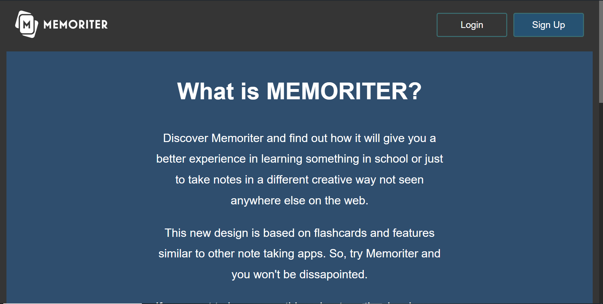

# Memoriter v1.0

Interesting that you have scrolled down so far down... Anyways, this was the first version of Memoriter, created in the span of less than a year by some students with almost no programming experience. Therefore, the code was a completely mess and the application was buggy as hell.

<figcaption>Screenshot from the first informational site of Memoriter</figcaption>

## Features

The features of the application were few and simple. You had the option to create folders and flashcards and that was it, but there is other stuff worth mentioning). Yes here are the main features:

- A way to simple, not marked ready minimum viable product,
- a suboptimal design because noone of us had experience in that field,
- weird issues no one could explain (for instance on Apple's Safari-Browser was a weird gradient at the bottom of each flashcard),
- a none-existent mobile optimization making it impossible to use the app outside of a laptop or desktop PC,
- the worst database optimization I have ever seen (seriously, when data was requested, all pieces of data from the servers were sent to your device to pick the right ones, resulting in downloading way too much unnecessary content. At least no one was using the app at this point and is was still better than an issue occurring while developing version 1.1, resulting in crashing the entire database until all invalid pieces of data were removed manually),
- an informational page wich was also bad because it was made in only a week or so which oushed me into spending hundrets of hours to create this site (see the screenshot above)...

Even though our first attempt was not that good we were able to create a foundation to build on and to create something awesome. We all have gained a LOT of experience working on this project and for me it was the beginning of my interest in web development and programming in general. It was (and still is) extremely fun working on Memoriter... Thanks for reading!

The release note author and main developer